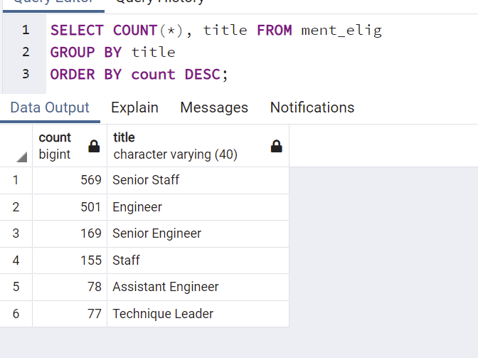

# Pewlett-Hackard-Analysis 

## Overview of Pewlett-Hackard Analysis
The purpose of this analysis was to determine the number of retiring employees per title, and identify employees who are eligible to participate in a mentorship program.

## Pewlett-Hackard Analysis Results
Based off the results of the Pewlett-Hackard-Analysis it appears that:
    - the Senior Engineer position had the most retirees.
    - the manager position had the least retirees.
    - the Senior Staff postion had the most eligible mentors.
    - the Technique Leader had the least amount of eligible mentors.

  

  

## Pewlett-Hackard Analysis Summary  
Based off the results of the Pewlett-Hackard-Analysis it appears that 90,398 roles will need to be filled as the "silver tsunami" begins to make impact.

Based off the results of the Pewlett-Hackard-Analysis it appears that there is not enough retirement-ready employees in the departments to mentor the next generation of Pewlett Hackard employees.

  
